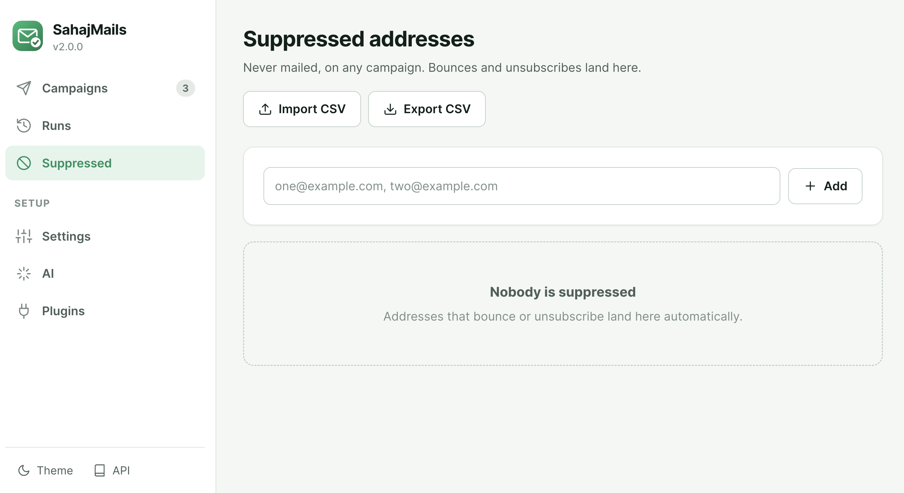

# Deliverability

Sending is easy. Landing in the inbox is the hard part. SahajMails does the
mechanical parts for you and tells you about the rest.

## What it does automatically

**A real plain-text part.** Every message is `multipart/alternative`. HTML-only
mail is one of the strongest spam signals there is.

**`List-Unsubscribe`.** Gmail and Yahoo have *required* this from bulk senders
since February 2024. Set an unsubscribe address in Settings and it is added to
every message, with `List-Unsubscribe-Post` for one-click when you also supply
an HTTPS endpoint.

**A well-formed envelope.** Correct `Message-ID`, `Date`, RFC 2047 subject
encoding, and internationalised addresses.

**Sensible pacing.** A token bucket at your provider's documented rate, with
jitter — a perfectly regular cadence is itself a bot signal.

## What it checks and tells you

Pre-flight looks up your sending domain's **SPF, DKIM and DMARC** and explains
what is missing. If you send from `@gmail.com` it tells you the provider handles
this and moves on.

Setting these up on your own domain, in order of impact:

```dns
; SPF — who may send as you
example.com.        TXT  "v=spf1 include:_spf.google.com ~all"

; DMARC — what receivers should do when checks fail
_dmarc.example.com. TXT  "v=DMARC1; p=none; rua=mailto:reports@example.com"
```

Start DMARC at `p=none`, read the reports for a few weeks, then move to
`p=quarantine`. DKIM is enabled in your mail provider's console; it cannot be
discovered from the domain alone.

The **content linter** flags what tends to get filtered: an empty or shouting
subject, a body that is mostly images, link shorteners, spam-associated phrasing,
a missing unsubscribe header, oversized attachments, and template syntax that
failed to resolve.

## Bounces



Sending repeatedly to dead addresses is the fastest way to ruin a sending
reputation. Add hard bounces to the suppression list, which is enforced on every
campaign automatically:

```bash
sahajmails suppress add dead@example.com --reason bounce
```

Suppressed addresses import and export as CSV from the Suppressed page, so you
can share a list between machines or bring one from another tool.

## Volume

| Provider | Documented daily limit |
|---|---|
| Gmail (free) | 500 |
| Google Workspace | 2,000 |
| Outlook | ~300 |
| Yahoo / Zoho | 500 |
| SES, Mailgun, Postmark, SendGrid | no fixed daily cap |

Pre-flight warns before you exceed the limit rather than at message 501. If you
regularly send more than a few hundred, use a transactional provider — they
exist for this, and consumer mailboxes do not.

## Practical advice

- Warm up a new sending domain over days, not hours.
- Send to people who expect to hear from you. Nothing above compensates for a
  list that did not opt in.
- Always send yourself a test first, and open it on a phone.
