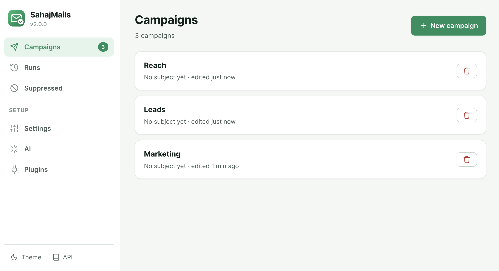
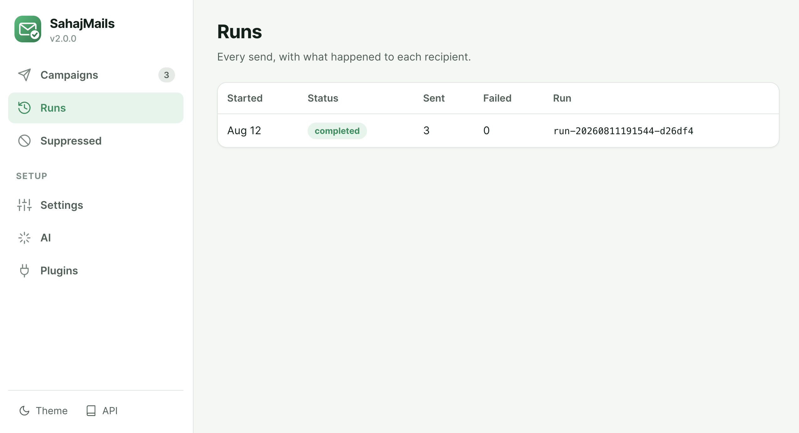

# Getting started

## Install

```bash
pip install sahajmails
```

Python 3.11 or newer. Nothing else to set up.

## Open the app

```bash
sahajmails
```

Your browser opens at `http://localhost:8000` with a one-time token in the URL.
That token is what stops anything else on your machine from driving your mail
sender, so use the link the terminal prints — bookmarking the bare address will
not work.

## Connect your mailbox

**Settings → your email address → provider → app password → Test connection.**

Almost every provider now refuses your normal password over SMTP. You need an
*app password*:

| Provider | Where to get one |
|---|---|
| Gmail | Turn on 2-Step Verification, then [myaccount.google.com/apppasswords](https://myaccount.google.com/apppasswords) |
| Outlook | Security → Advanced security → App passwords |
| Yahoo | Account Security → Generate app password |
| iCloud | [appleid.apple.com](https://appleid.apple.com) → App-Specific Passwords |

By default the password is held **in memory only** and forgotten when you stop
the server. Tick *Remember on this machine* to store it in a file only your user
account can read.

## Your contact file

A CSV or `.xlsx` with a header row and an email column:

```csv
email,first_name,company
alice@example.com,Alice,Acme Corp
bob@work.com,Bob,Startup XYZ
```

Every other column becomes a placeholder. The column can be called `email`,
`e-mail`, `Email Address`, `recipient` — it is detected for you.

Blank rows, duplicates and malformed addresses are reported with their row
number and skipped, not silently dropped.

## Write it

Pick a format:

- **Formatted** — a toolbar. Bold, lists, links. Good default.
- **Plain** — exactly what you type, nothing interpreted. Best for formal letters.
- **Markdown** — `**bold**`, `# heading`, `[link](url)`.
- **HTML** — paste a complete document; it is sent untouched.

Insert placeholders by clicking a column chip. The preview on the right shows a
real contact, and the arrows step through your list, so you see what actual
people will receive.

## Review, then send



**Review** runs pre-flight: it renders *every* contact, checks your addresses,
your DNS records, your content, and your provider limits. Then send yourself a
test — it uses your first contact's data, so it is exactly what they will get.

**Send** shows the count, the first few recipients, and any warnings before it
starts. You can pause, resume or stop mid-run, and if anything crashes you can
resume without mailing anyone twice.



## Next

- [AI personalization](ai-personalization.md)
- [Deliverability](deliverability.md) — the difference between sent and delivered
- [CLI reference](cli-reference.md)
