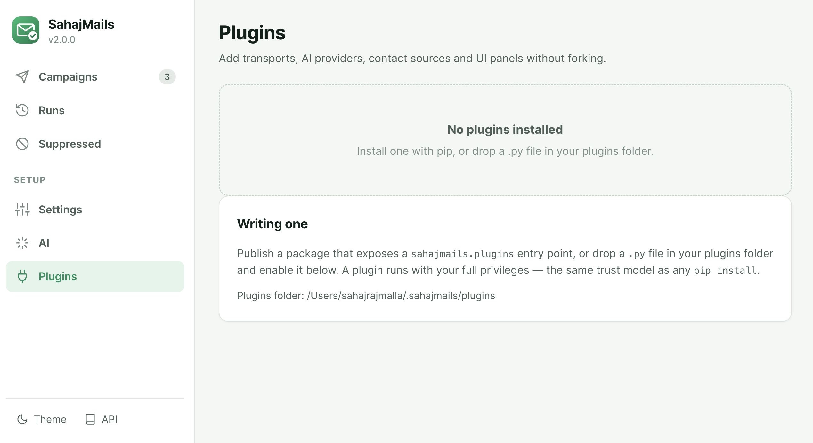

# Writing plugins

A plugin is a module with a `register(registry)` function.

> A plugin runs with your full privileges. That is the same trust model as any
> `pip install` — there is no sandbox, and pretending otherwise would be worse
> than saying so.



## A worked example

```python
"""sahajmails_slack — post to Slack after every send."""

import httpx

WEBHOOK = "https://hooks.slack.com/services/..."


def register(registry):
    registry.on_after_send(announce)
    registry.on_before_send(skip_competitors)
    registry.add_template_filter("shout", lambda s: str(s).upper())


def announce(result):
    if result.status == "failed":
        httpx.post(WEBHOOK, json={"text": f"Bounced: {result.email} — {result.error}"})


def skip_competitors(contact, message):
    """Returning False vetoes this message."""
    return not contact.email.endswith("@competitor.com")
```

Ship it with an entry point:

```toml
[project.entry-points."sahajmails.plugins"]
slack = "sahajmails_slack"
```

`pip install sahajmails-slack` and it loads. Or drop the file in
`~/.sahajmails/plugins/` and enable it on the Plugins page — local files are
disabled until you explicitly enable them, because dropping a file in a folder
is a much lower bar than installing a package.

## Hooks

| Hook | |
|---|---|
| `add_transport(name, factory)` | A new way to deliver — an HTTP API, an internal relay |
| `add_ai_backend(name, factory)` | A new AI provider |
| `add_contact_source(name, loader)` | Pull contacts from a CRM, a sheet, a database |
| `add_template_filter(name, fn)` | A Jinja filter |
| `on_before_render(contact, context)` | Add or change template variables |
| `on_after_render(contact, rendered)` | Rewrite the rendered email |
| `on_before_send(contact, message)` | Inspect, mutate, or **veto** by returning `False` |
| `on_after_send(result)` | Log to an external system |
| `add_ui_panel(id, title, url)` | Add a nav item and panel to the web UI |
| `add_cli_command(command)` | Add a `sahajmails` subcommand |

## Rules of the road

- A hook that raises is logged and skipped. One misbehaving plugin cannot take
  a thousand-message send down with it.
- A plugin that fails to import is recorded and skipped; the app still starts.
- Enabling or disabling requires a restart. Importing arbitrary code into a
  running process cannot be undone, so a restart is the honest answer.
- Re-registering a built-in name replaces it, which is how you deliberately
  override the SMTP transport.
